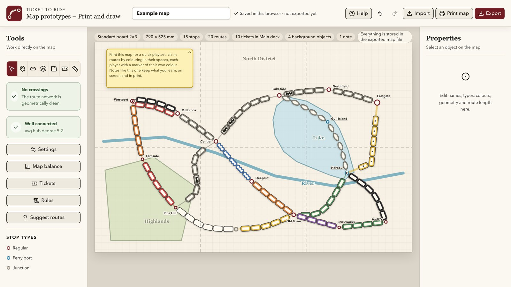
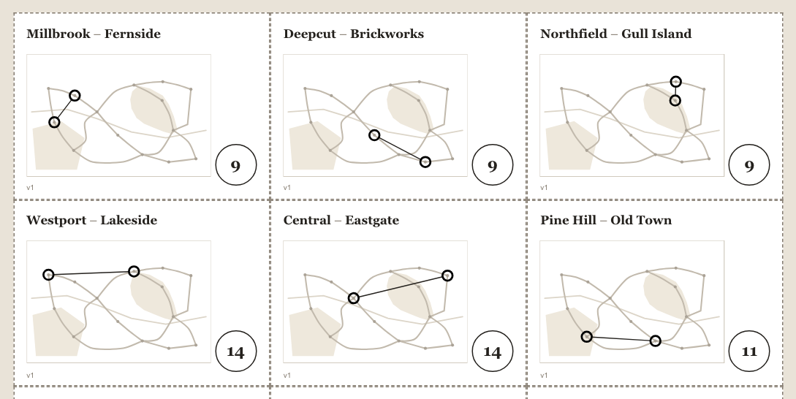
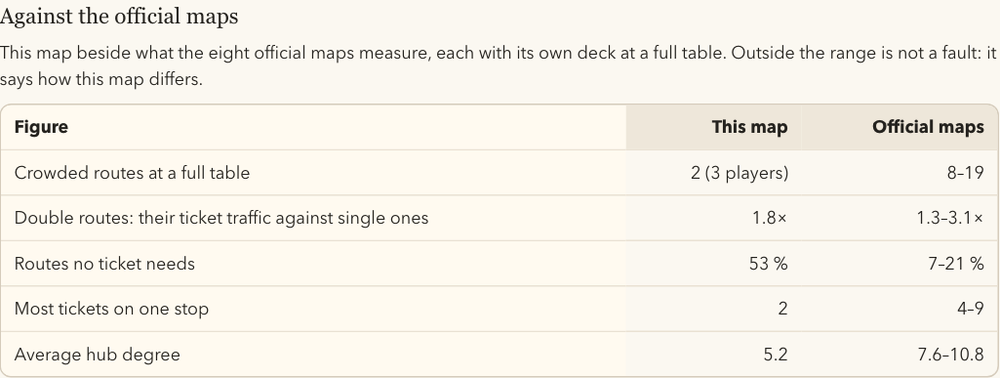

# Ticket to Ride Map Editor

**[Open the editor at hagstrom.nu/ttr](https://hagstrom.nu/ttr/)**: it runs in the browser, there is
nothing to install, and the map you work on stays in your browser. [What's new](CHANGELOG.md) ·
[A tour in 80 seconds](https://youtu.be/AS7XWDRvOEE)

A workshop for Ticket to Ride maps that do not exist yet. Draw a board, place the stops, connect them
with routes, work out a deck of destination tickets, and print it all to play on paper.



## What this is for

You draw a board, print it, and play on it with highlighter pens: each player takes a colour and fills
in the wagon spaces they claim. When the game is over you have a marked-up sheet showing what was fought
over and what nobody touched, which is the part that tells you what to change.

Two things make that feel like a real game rather than a sketch. Keep each player's wagons in front of
them from a real set, and put one back in the box for every space they fill in: the pile in front of
them is then exactly how many they have left, which is the pressure the game runs on. And if you print
the board at full size, the spaces are the size of real wagons, so you can lay the plastic trains on the
paper instead of drawing at all.

It is meant for the stretch before a map is any good — the many many prototypes where the question is
whether the network hangs together at all, not whether the artwork is right. Nothing leaves your
browser: the map is stored locally, and files move by export and import.

## Wagon spaces are real size

A wagon space is drawn at the size a real 20 × 9 mm train takes up on a 790 mm board, with the spacing
measured from a hundred real routes. A route six spaces long has room for six plastic trains when you
print at full size, and if a route is drawn too short for its spaces, Map balance says so, in
millimetres.

## Boards, cards and spreadsheets

A board lies or stands, in the standard 2×3 or the extended 2×4. Standing it up or laying it down turns
everything on it a quarter turn without changing a single distance.

The ticket cards print to be cut out, lying or standing as the board does, and each carries a small map
of the whole board with its two stops ringed and joined by a line, as the real cards do.

The tickets, the routes, the stops and the distance between every two stops can go out to a
spreadsheet, and stops, routes and tickets can come back in from one: an export of your own, or a list
typed by hand. Stops without a position are laid out from the routes, ready to be dragged into place.
Starting from nothing, take the templates: one zip, under Import and under Export, with a file to fill in for each kind and
a guide to every column.

## Print, play, print again

One print run takes the board, the ticket cards and the rules, or any of them: the board on a single A4
or Letter sheet for a quick game, one sheet per fold panel, or at full size. The rules can be printed
from the Rules panel on their own, and a page of the balance figures can go with them, so a printed or
saved milestone says what the editor thought of the map at the time. The same dialog saves a PDF.



Then you play, look at the marked-up sheet, change the map and print again. Every print and export after
a change gets the map's next version number, on every sheet and card, so the sheets from several
playtests never get mixed up. A yellow playtest box on the board has a line for the date you played it;
the players' names go on the back of the sheet.

## Where the numbers come from

The advice the editor gives is measured against fifteen official Ticket to Ride maps, transcribed route
by route and ticket by ticket, eight of which are complete and consistent enough to calibrate against:
USA, Europe, Nordic Countries, India, Switzerland, Old West, Polska and Northern Lights.

- **A ticket is worth the shortest path between its two stops**, counted in wagon spaces. That is what
  the official maps do: Nordic gets 46 of 46 tickets right that way, India 58 of 58, Polska 35 of 35.
  Colour, grey routes, tunnels and ferry locomotives are difficulty, not worth.
- **A deck gets a score**, lower is better: how the ticket lengths are spread, whether long tickets reach
  the edges, how many stops no ticket names, near-duplicate pairs, routes no ticket needs, and how evenly
  the traffic falls. Every official deck scores clearly better than random decks of the same size.
  Building a deck is a search for a low score. The score is a guide, not a verdict: the official decks
  are more uneven than the editor's own suggestions, on purpose.
- **Official maps are tense, but connected.** Each has 8 to 19 routes at a full table that more tickets
  want than they can carry, mostly on double routes, yet almost nothing on them can be cut off. Map
  balance describes crowding, dead ends and corners against them, and warns only about a single-lane
  route that cuts the map in two. A deck can be built calm, like the official maps, or tense, and a
  route or stop can be marked as crowded on purpose.



- Every target is an average of the official decks rather than one game's habits. Fitted to the USA map
  alone, several official decks scored worse than random ones.

## What it will not do

It does not play the game. Everything it says is read off the shape of the network, not off simulated
play, so it can tell you that eleven tickets all want the same route, but not whether that is exciting
or unfair. That is what the highlighter pens are for. It has no opinion about the art, no country or
region tickets yet, and no rules for zones, festivals or shared track.

## Choices behind it

- **Points are the shortest path, always.** A long-ticket bonus and a ferry premium exist as options,
  both off unless a map asks for them.
- **Crowding is shown, never priced.** Map balance lists the routes more tickets want than they can
  carry; no official designer pays extra for a crowded corridor.
- **Ticket lengths are relative to the map**, as shares of its longest journey, so the same mix means the
  same thing on a small map and a large one.
- **Files keep what they do not understand.** Every file says which schema it follows, and fields written
  by a newer version are carried through untouched.

The full record is in [docs/DECISIONS.md](docs/DECISIONS.md), and the file format in
[docs/FILE-FORMAT.md](docs/FILE-FORMAT.md).

Ticket to Ride is a game by Alan R. Moon, published by Days of Wonder. This is an unofficial tool for
designing your own boards, and is not affiliated with them.

## Everything it does

<details>
<summary>The full list, feature by feature</summary>

- Draw, move and edit stops and routes, each with a hint box over the map listing what can be done with the selected object directly on the canvas.
- Shape a route freely: add as many bend points as you like anywhere along it, and optionally draw it as a smooth curve that the wagon slots follow.
- Fully customise route types: rename, restyle (thickness and dash pattern) or delete the built-in city/region/rapid transit/ferry/railway/trail types, and add your own. Types are told apart by line shape, never by colour, so every route keeps its own wagon colour whatever its type.
- Build double routes: two or more parallel lines between the same pair of stops, each in its own colour, drawn side by side automatically.
- Fully customise stop types too: rename, recolour or delete the built-in six and add your own.
- Choose one of three stop sizes, which can carry meaning in some expansions.
- Mark a stop with a dot, dash, cross or a short letter code, independent of its type.
- Lock a stop's position so it cannot be dragged by accident, one stop at a time or every stop at once, and Shift-drag to move one anyway.
- Turn a stop's name around the stop to keep it clear of the routes running past it, with a warning listing names that cover a route, a one-click move to a clear position, and a Move names clear button that turns the whole map's names at once and names the stops it could not solve.
- Mark specific wagon slots on a route as requiring a locomotive card.
- Define named wagon styles to mark routes that play by their own rules: serrated tunnel edges, notched corners or a heavy outline, with an optional letter drawn in every space. A tunnel style ships with every map and can be renamed or restyled like any other.
- Wagon spaces, stop circles and the gap between the lines of a double route are all drawn at the size a real board uses, with an adjustable amount of room left around each stop, set for the whole map or per stop so the two ends of one line can differ.
- Wagons are always measured against the board the map is for, so you can judge how crowded the finished board will actually be. Printed at full size, the wagons are exactly real size; printed smaller, they shrink with everything else, so the layout always matches the board. Routes drawn too short for their own wagon count are outlined in red.
- Define reusable custom line styles (thickness and dash pattern) to flag routes that follow a special rule, and set a default style so new routes pick it up automatically.
- Add areas, boundaries and labels behind the route network.
- Import a background image (PNG, JPEG or WebP) — from the Import menu or the Draw background tool — and move, scale, rotate, crop, fade or lock it behind the rest of the map, or centre it and fit it to the page with a print-safe margin in one click.
- Place resizable evaluation notes with explanatory text on the map, for reviewers and playtesters, and fold one down to a single line when it is in the way.
- Choose the board in Settings: the standard 2×3 board or an extended 2×4, lying (landscape) or standing (portrait), with a line drawing beside the choices of the board, its fold panels, its size and a ticket card as it will print. Standing a board up or laying it down turns everything on it a quarter turn, as one undoable step. That is all the map itself knows about paper.
- Detect crossings between buildable routes.
- Check that each route is drawn about as long as its wagon count needs, and see which routes are too short or unnecessarily roomy.
- Analyse how balanced the network is: hub degree and neighbour count per stop, a colour-by-length distribution table with the wagons each colour adds up to, set against the seven classic maps, the deck's ticket lengths against the official decks and the map's own rules, how the network holds together (dead ends, routes whose loss cuts the map in two, corners reached through one or two stops, each beside what the official maps have; only a route with one lane that cuts the map in two is a warning). It opens in the right column beside the map: point at a row or number to see it on the map, click to keep it marked, drag the column wider.
- Measure the shortest travel distance between any two stops (by route length, not straight-line distance).
- Build a destination ticket deck by clicking two stops, with points suggested from the shortest path and from what the map's other tickets are worth. The ticket list flags unreachable pairs, duplicates and points far from what the distance implies, shows the spread of ticket lengths, and names the stops no ticket sends anyone to.
- Two-click tools say what they are waiting on: the first stop is ringed and tagged, a rubber band follows the pointer, and hovering the far end previews the ticket or the distance the second click would produce, with the path it would use lit on the map. Escape drops a half-finished pick, and clicking the current tool again lets it go.
- While the ticket tool is in use the right-hand panel lists every stop with how many short, medium and long tickets name it, sortable by name or by any of the three, with a filter that leaves only the stops no ticket has reached yet. Any count opens the tickets behind it and leads through to editing them. The length bands are a stand-in until the real definition arrives.
- See where the tickets crowd: the balancing view lists the routes more tickets want than they can carry, at a table you choose within the map's own player range, and marks them on the map. Only the second lane of a double route depends on the player count, so the list is how much tighter the smallest game gets.
- Set up how a game on the map is played: how many players it is built for, how many wagons each has, how many destination tickets are dealt at the start and how many of those a player must keep. Map balance reads all of it against the map — whether the map holds enough wagon spaces for a table to spend their supplies, and whether the deck is thick enough to deal from. They sit with the board format in Settings, which opens by itself on a new map, and travel in the map file, defaulting to the original game's 45 wagons and 3 tickets of which 2 are kept.
- Decide the map's own mix of short, medium and long tickets: where each boundary sits, as a fraction of the map's longest journey, and what share of the deck belongs in each band. The official USA and Europe mixes are one click away. The ticket panel counts by those boundaries, and a full deck of tickets is built to that mix instead of its style's own spread.
- Write the rules of the map being designed in a Rules panel beside the map: markdown in a plain text area with a toolbar (bold, italic, heading, lists, quote, table, line, and pickers that write a stop or a route), kept in the map file, with a live preview. The example map comes with example rules. `[[Westport]]` and `[[Westport–Central]]` are drawn as the map draws that stop and route, and pointing at one marks it on the map. The print dialog ticks what goes in a run, the board, the tickets as cut-out cards and the rules, in any combination, and prints them in that order. The board can also go on one page as big as the board itself, at real size, to send to a large-format printer or to save as a PDF.
- A version number, shown under Help, with a What's new page that says what changed in each version (kept in `app/version.ts`, checked by `npm run test:releases`, and on GitHub as [CHANGELOG.md](CHANGELOG.md)).
- An About page under Help explains what the tool is for, how the numbers are arrived at and the choices behind it, for anyone you share a map with.
- Build a full deck of tickets for the map that is open. The three shapes — Generic, Classic and Europe — are laid out side by side with what each does to the deck, its lengths and its scoring, so they can be compared before one is picked.
- Sort the ticket list by any of its headings — ticket, spaces, points, suggested value or the long flag — on a deck you built by hand and on one that came from a suggestion. It starts in the order the deck was built, and tickets stay editable while sorted.
- Keep several named ticket decks in one map and switch between them, and set this deck against another figure by figure in the Tickets panel (tickets, points, lengths, length bands, stops no ticket names, crowded routes and more, with the difference), so variants can be judged side by side. Decks can be duplicated, exported and imported on their own, and printed as cut-out cards, 62 × 45 mm, lying or standing as the board does, each with a small map of the whole board, its two stops ringed and joined by a line, as on the real tickets. An imported deck always arrives as a new deck and matches stops by name when the ids differ, so a deck can travel between copies of a map. Selecting a stop lists every ticket that names it, in any deck, and each one opens for editing.
- Get automatic route suggestions between nearby, unconnected, poorly-connected stops, with a starting length and colour guess drawn from the balance analysis, that you can add with one click and then adjust.
- Undo and redo up to 200 changes during the current session, with Cmd/Ctrl+Z and Cmd/Ctrl+Shift+Z.
- Save automatically in the current browser, with a reminder to export a copy after a while of work, which can be made rarer or turned off, and the time of the last export in the header.
- Import and export complete maps as JSON, or just the background or the route network on their own, and save the board as a PNG picture.
- Export the tickets, routes, stops or the distance between every two stops as spreadsheets (CSV), and import stops, routes and tickets from spreadsheets: our own exports, the reference data's, or a list typed by hand. Positions and the bends of routes are kept, fitted to the board, or worked out from the routes when there are none. Templates for each kind, and a guide to their columns ([docs/CSV.md](docs/CSV.md)), are under Import.
- Print from a dialog that decides each run without touching the map: the whole board on one sheet, one sheet per fold panel, or full size across as many sheets as it takes, with trim marks; on A4, A3, US Letter or Tabloid; and for a 2×3, the larger Anniversary board at full size, or the whole board on one big page for a plotter or a PDF. One table of the board's sheets (count and scale for every paper and way to split) is where the choice is made, by clicking a cell. The last choice is remembered in the browser.
- Show a neutral example map to first-time visitors.

</details>

Styles are applied from the Properties panel and defined in one shared Styles dialog, reachable in
one click from wherever a style is applied.

## Important storage behaviour

The application has no server-side database. A map is automatically stored in the current browser under the key `ttr-map`; a map kept by an older version of the editor is picked up the first time a newer one runs.

Browser storage is specific to one browser and device. Export the map regularly to create a portable backup.

The example map is used only when no stored map exists. **Start over** (Settings, under Map) creates a genuinely empty map and never reloads the example.

## Local development

Requirements:

- Node.js 22.13 or newer
- npm

Install and start the development server:

```bash
npm install
npm run dev
```

Open <http://localhost:3000/ttr/>.

Create the static production build:

```bash
npm run build
```

The deployable website is generated in `out/`. Its contents are intended to be served from the `/ttr` path on a normal static web host.

## Project structure

| Path | Purpose |
| --- | --- |
| `app/map-data.ts` | Map types, board formats, empty map and first-visit example map |
| `app/board.ts` | The board as it lies or stands, and turning a map a quarter turn |
| `app/board-preview.tsx` | The line drawing of the board beside its choices in Settings |
| `app/csv-export.ts` | Tickets, routes, stops and distances as spreadsheets |
| `app/csv-import.ts` | Stops, routes and tickets read back from spreadsheets, with positions |
| `app/map-editor.tsx` | Editor state, pointer interactions and layout |
| `app/map-geometry.ts` | Route geometry, curves and intersection primitives |
| `app/map-analysis.ts` | Balance metrics, shortest path and route suggestions |
| `app/map-storage.ts` | Local storage, file normalizers and format rescaling |
| `app/map-artwork.tsx` | SVG rendering of the map |
| `app/map-properties.tsx` | Properties panel editors |
| `app/map-dialogs.tsx` | Welcome guide, balance report, tickets panel and suggestions |
| `app/map-print.tsx` | Print pages and the print dialog |
| `app/print-plan.ts` | How a board is cut into sheets for a print choice |
| `app/globals.css` | Main editor layout and visual styling |
| `app/editor-additions.css` | Route handles, mobile behaviour and print layouts |
| `app/layout.tsx` | Page metadata and global layout |
| `next.config.ts` | Static export and `/ttr` hosting configuration |
| `BACKLOG.md` | Planned product work |
| `docs/ARCHITECTURE.md` | Application structure and state flow |
| `docs/MAP-FORMAT.md` | JSON project format and compatibility rules |
| `docs/DEPLOYMENT.md` | Build, Websupport deployment and rollback |
| `docs/PRINTING.md` | Board versus print choices, sheet arithmetic, page box and print testing |
| `docs/TERMINOLOGY.md` | The words the editor uses, what they mean, and the ones it does not |
| `docs/CSV.md` | What the spreadsheet columns mean |

## Verification

```bash
npm run typecheck
npm run build
```

Plus a browser regression suite, which needs the dev server running in another terminal:

```bash
npm run dev
npm run test:regression
```

It drives the editor with Playwright and makes about two hundred checks, from the welcome guide and
the example map through route editing, real-size wagons, the balance, ticket and suggestion panels and
the ticket tools to the print dialog, including real PDFs printed with the browser's own margins. If it
breaks off part way, it still lists the checks it made before stopping.

`npm test` runs the typecheck, lint, the suggester, calibration, file-format, print-plan, markdown,
release-notes, CSV export and import, and board checks, and the build. The suggester and calibration checks measure the ticket suggester against official maps, which
are private and live in their own repository beside this one, `../ttr-reference-data` (or wherever
`TTR_REFERENCE_DATA` points). Without it those two say so and are skipped; everything else, and the
editor itself, needs none of that data. `npm run test:synthetic` runs the suggester on small invented
maps (`tests/fixtures/synthetic-maps.cjs`) and always runs: it shows that the suggester behaves (valid,
repeatable decks worth their shortest path, within reach, following the rules it is given), not that it
is calibrated against the real games. The suggester's targets are already written into the code, so
the data is only needed to change or re-check its calibration. Printing is described in `docs/PRINTING.md`.

Edits to `app/globals.css` do not reach a running dev server: it keeps serving the old rules until
it is restarted (stop it, delete `.next`, start it again). Edits to `app/editor-additions.css` arrive at
once. Checked twice, in two working copies, on 30 September.

The dev server sends CSS pretty-printed and with properties reordered, so check a change with
`scripts/served-css-rule.sh '<selector> {'` rather than by grepping for the line as written.

It is a single script rather than a Playwright test project, and it expects the editor at
`http://localhost:3000/ttr/`. It has caught real bugs — a handle's hit area swallowing the click
that marks a locomotive, editing handles measured from the wrong line on double routes — so it
earns its place, but it is not wired into CI. The checks that do not need a browser are separate scripts
beside it in `tests/` (file format, print plan, markdown, release notes, and the suggester and its
calibration), and `npm test` runs them.

If a change does not take effect locally, check for an orphaned dev server before suspecting the
build. `npm run dev` falls back to port 3001 when 3000 is already taken, printing only a warning, so
a previous server left running keeps serving the old code on 3000 while the new one compiles your
edits somewhere you are not looking. `pgrep -f next-server` shows them; stop them all before
starting a new one, and do not delete `.next` while a server is running.

`next.config.ts` pins the Turbopack root to the project, because a `package-lock.json` in a parent
directory otherwise makes Next take that directory as the root. A `.next` cache built under the
wrong root keeps failing after the fix — `Can't resolve 'tailwindcss'` in a loop, which once ran the
machine out of memory — so after changing the root, stop the server, delete `.next`, and start again.

## Source of truth

The source lives in the GitHub repository `bjornhagstrom/ticket-to-ride-map-editor`. Generated folders such as `.next/`, `out/` and `node_modules/` must not be committed.

## Licence

The code and the documentation in this repository are released under the MIT licence: see [LICENSE](LICENSE). It covers this editor, not the Ticket to Ride game, its name or its maps, which belong to their owners; the editor is an unofficial tool and is not affiliated with the game's publisher. `vendor/` holds a stylesheet from shadcn, which keeps its own MIT licence beside it.
